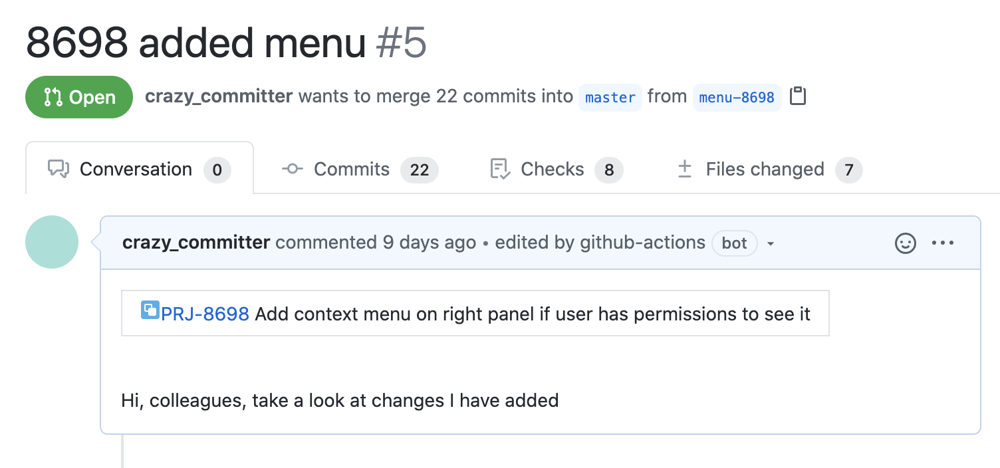

# jira-description-action

> A lightweight solution to integrate GitHub with JIRA for project management. 🔎


## Installation

To make `jira-description-action` a part of your workflow, just add a `jira-description-action.yml` file in your `.github/workflows/` directory in your GitHub repository.

> **Note**
> This action fetches PR description and does not take it form context. So if you are chaining a few actions which work with PR description, put this one as the last one
 
```yml
name: jira-description-action
on:
  pull_request:
    types: [opened, edited]
jobs:
  add-jira-description:
    runs-on: ubuntu-latest
    steps:
      - uses: cakeinpanic/jira-description-action@v0.3.3
        name: jira-description-action
        with:
          github-token: ${{ secrets.GITHUB_TOKEN }}
          jira-token: ${{ secrets.JIRA_TOKEN }}
          jira-base-url: https://your-domain.atlassian.net
          skip-branches: '^(production-release|main|master|release\/v\d+)$' #optional 
          custom-issue-number-regexp: '^\d+' #optional
          jira-project-key: 'PRJ' #optional    
```
`
## Features
When a PR passes the above check, `jira-description-action` will also add the issue details to the top of the PR description. 

### Options

| key                    | description                                                                                                                                                                                                                                                                                                        | required | default |
| ---------------------- | ------------------------------------------------------------------------------------------------------------------------------------------------------------------------------------------------------------------------------------------------------------------------------------------------------------------ | -------- | ------- |
| `github-token`         | Token used to update PR description. `GITHUB_TOKEN` is already available [when you use GitHub actions](https://help.github.com/en/actions/automating-your-workflow-with-github-actions/authenticating-with-the-github_token#about-the-github_token-secret), so all that is required is to pass it as a param here. The `GITHUB_TOKEN` needs to have read & write permissions over the repository. You can either set permissions in the workflow file, or in the repository configuration. (see [Control permissions for GITHUB_TOKEN](https://github.blog/changelog/2021-04-20-github-actions-control-permissions-for-github_token/#setting-the-default-permissions-for-the-organization-or-repository)) | true     | null    |
| `jira-token`           | Token used to fetch Jira Issue information.  Check [below](#jira-token) for more details on how to generate the token.                                                                                                          | true     | null    |
| `jira-base-url`        | The subdomain of JIRA cloud that you use to access it. Ex: "https://your-domain.atlassian.net".                                                                                                                                                                                                                    | true     | null    |
| `skip-branches`        | A regex to ignore running `jira-description-action` on certain branches, like production etc.                                                                                                                                                                                                                                    | false    | ' '     |
| `use`                  | Enum: `branch \| pr-title \| both`, to search for issue number in branch name or in PR title                                                                                                                                                                                                                               | false    | pr-title     |
| `jira-project-key`     | Key of project in jira. First part of issue key | false    | none     |
| `custom-issue-number-regexp` | Custom regexp to extract issue number from branch name. If not specified, default regexp would be used.  | false    | none     |
| `fail-when-jira-issue-not-found` | Should action fail if jira issue is not found in jira  | false    | false     |

Tokens are private, so it's suggested adding them as [GitHub secrets](https://help.github.com/en/actions/automating-your-workflow-with-github-actions/creating-and-using-encrypted-secrets).

### `jira-token`

The Jira token is used to fetch issue information via the Jira REST API. To get the token:-
1. Generate an [API token via JIRA](https://confluence.atlassian.com/cloud/api-tokens-938839638.html)
2. Add value `<jira username>:<jira api token>` to the `JIRA_TOKEN` secret in your GitHub project.
   For example, if the username is `ci@example.com` and the token is `954c38744be9407ab6fb`, then `ci@example.com:954c38744be9407ab6fb` needs to be added as a secret

Note: The user should have the [required permissions (mentioned under GET Issue)](https://developer.atlassian.com/cloud/jira/platform/rest/v3/?utm_source=%2Fcloud%2Fjira%2Fplatform%2Frest%2F&utm_medium=302#api-rest-api-3-issue-issueIdOrKey-get).

### Skipping branches

`skip-branches` must be a regex which will work for all sets of branches you want to ignore. This is useful for merging protected/default branches into other branches. Check out some examples in the tests in thi repo

`jira-description-action` already skips PRs which are filed by [dependabot](https://github.com/marketplace/dependabot-preview)

### Searching in branch name/PR title

By default issue key is searched in PR title(which can easily be changed). `use` option can be set to `branch` if you want to get issue key from branch name. Or to `both` to look first in pr-title, then in branch name

### Using custom regex
If `custom-issue-number-regexp` is not provided, full key of issue is searched using regexp `/([a-zA-Z0-9]{1,10}-\d+)/g;`.
For example
```
bugfix/prj-15-click -> PRJ-15
prj-15-bugfix-17 -> PRJ-17
15-bugfix -> nothing found
``` 
Custom regexp would work like that(check for more [in tests](__tests__/utils.test.ts#106)):
```
custom-issue-number-regexp: 'MYPROJ-\d+' 
```
```
bugfix/MYPROJ-15-click -> MYPROJ-15
prj-15-myproj-17 -> MYPROJ-15 // it is insensitive by design
15-bugfix -> null
```

If you don't use full keys in branch names, you can specify optional parameters to compute issue keys. 
It would be appended to found key as `${jira-project-key}-{regexp-match}`:
```
jira-project-key: 'MYPROJ'
custom-issue-number-regexp: '\d+' 
```
```
bugfix/prj-15-click -> MYPROJ-15
prj-15-bugfix-17 -> MYPROJ-15
15-bugfix -> MYPROJ-15
```
Groups in regexp can also be used(last group in a match would be taken):
```
jira-project-key: 'MYPROJ'
custom-issue-number-regexp: '-(\d+)' 
```
```
bugfix/prj15-239-click -> MYPROJ-239
15-bugfix -> null
```
